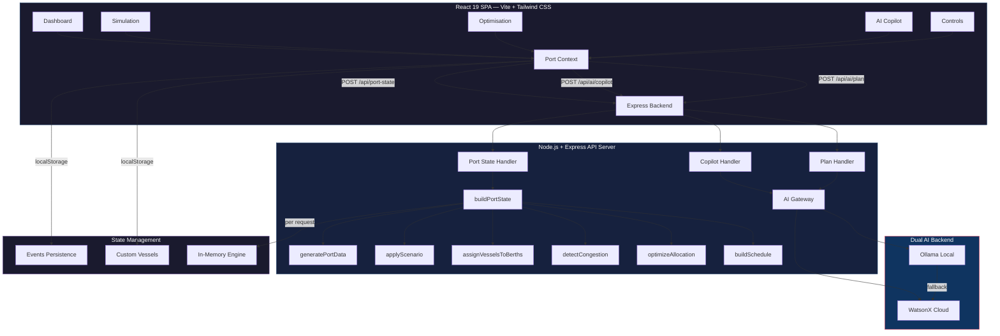

# Architecture — PortPredict AI

## System Architecture

## Component Table

| Component | Technology | Responsibility |
|---|---|---|
| Frontend SPA | React 19 + Vite | User interface, routing, state management |
| Styling | Tailwind CSS + shadcn/ui | Responsive design, dark theme |
| Routing | React Router | Client-side navigation (5 tabs) |
| State Context | React Context + localStorage | Persistent events, custom vessels, berth closures |
| API Server | Express (Node.js) | HTTP endpoints, request validation |
| Scheduling Engine | TypeScript (pure functions) | Berth assignment, queue management, conflict detection |
| Congestion Detector | TypeScript (pure functions) | Rolling window scoring, driver attribution |
| Optimizer | TypeScript (pure functions) | Greedy berth reassignment, hours-saved calculation |
| Simulation | React + SVG | Interactive maritime digital twin with timeline |
| AI Gateway | TypeScript | Unified interface to Ollama/WatsonX with fallback |
| WatsonX | IBM watsonx.ai API | Streaming AI inference for copilot and planner |
| Ollama | Local LLM server | Offline AI inference fallback |

## Data Flow

1. **User adds vessels** (CSV import or manual entry) → stored in `localStorage` + React context
2. **Events created** (berth closures, crane outages, weather) → stored in `localStorage`
3. **API request** sent to `POST /api/port-state` with events + custom vessels
4. **Backend generates berth infrastructure** (B1-B6 fixed specs)
5. **Scenario applied** (closures null out affected vessel assignments)
6. **Vessels auto-assigned** to compatible open berths via greedy algorithm
7. **Schedule computed** (`buildSchedule`) — single source of truth
8. **Congestion detected** — rolling 6-hour window scores
9. **Optimization evaluated** — reassignment moves with hours saved
10. **Full state returned** to frontend — all views render from same data
