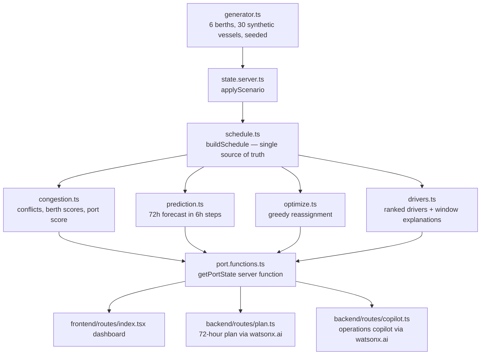

# PortOptiAI — Architecture

PortOptiAI is a port operations dashboard with a Node.js/Express backend and a
React SPA frontend. All vessel and berth data is **synthetic**, generated in-app
from a fixed seed. No real port, AIS or IoT source is connected.

## Flow

## Single source of truth

`buildSchedule(berths, vessels)` produces, for every vessel, its arrival,
service start, service end, wait hours, assigned cranes and any blocking
reason, plus per-berth utilisation. The simulation, the Gantt plan, congestion
detection, the metrics, the forecast and every table read this one result, so no
panel can drift out of sync.

Rules encoded in the schedule:

- Vessels queue per berth, ordered by ETA; priority cargo gets a 3-hour head start.
- More cranes handle faster — 3 cranes is the reference speed.
- A berth only handles its compatible vessel types.
- A closure with a stated duration removes capacity **until it reopens**; the
  queue restarts at that hour. A closure with no end blocks the whole window.
- A berth with no working cranes cannot serve anything.

## Congestion and prediction

- **Congestion**: per-berth score from overlap count, average wait and
  utilisation; port score is the weighted aggregate. Levels: low < 28,
  medium < 55, high < 80, critical above.
- **Prediction**: rolling 72 hours in 6-hour steps from a weighted formula over
  arrivals, waiting vessels, berthed vessels and usable capacity. Explainable —
  not machine learning.
- **Drivers**: the top five ranked causes of the current score, plus a per-window
  "Why?" breakdown behind the chart.

## Optimisation

A greedy heuristic: each delayed vessel is offered to the compatible, usable
berth that frees soonest. Every move records the hours saved, the cranes it
would get and the reasoning lines shown in the UI. Vessels that no berth can
take sooner are reported as unresolved rather than silently dropped.

## Scenarios

`applyScenario` supports berth closure, crane outage, vessel surge, severe
weather (×1.3 handling time) and vessel delay. It computes the baseline and the
scenario side by side, so the UI can show congestion and extra waiting hours
caused by the disruption.

## AI

`POST /api/ai/plan` streams a markdown 72-hour shift plan; `POST /api/ai/copilot`
streams answers to operator questions. Both are given the live schedule, drivers,
forecast windows, scenario impact and recommended moves, and are instructed to
answer only from that state. Powered by IBM watsonx.ai — requires a valid
`WATSONX_API_KEY` and `WATSONX_PROJECT_ID`.

## State

State is in-memory and derived per request from the seed plus the active
scenario, so a page reload or restart returns to the same baseline port.
